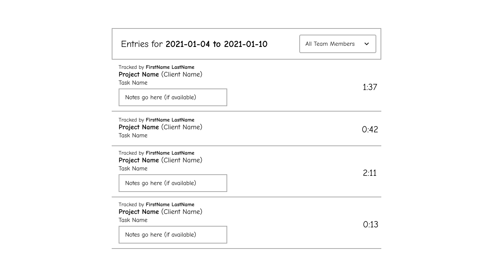

# Harvest Software Engineer Interview Exercise

Hello! We're excited you're interested in joining the Harvest team. This exercise is meant to model the type of work or concepts you might experience as a Harvest Software Engineer.

For this exercise, you will be asked to implement both a small client and server application using the Harvest API.

This exercise is considered a "take home" exercise. In your own time please work through the requirements outlined below. We ask that you **don't spend more than six hours** on the take-home exercise. If you finish faster: great! If you get part of the way through: that's no problem either. You will have the opportunity to explain any decisions you make based on these constraints when you share your work with the Harvest team.

# Expectations

## What are we expecting to get out of this assignment process?

- A **server application that can be used to query existing Harvest data**  and a simple **React based client application that can query the server you wrote and display that information according to the provided mockup,** both of which are free of obvious errors and defects.
- You're able to **demo** and **explain** your solution to our team–including any prioritization of tasks or tradeoffs you made.
- We are hoping to gain a better understanding of how you **collaborate**. We’ll invite you to join us as a guest in our Slack workspace.

## What we're not expecting

There are multiple ways to approach this exercise as such we are not expecting you to find the “One Right Solution.” We’re expecting a working and well-planned solution.

# Getting Started

## Creating your Harvest trial account

For this exercise, you’ll need to sign up for a trial account at [https://www.getharvest.com/signup](https://www.getharvest.com/signup).

Once you submit the signup form, you’ll be sent to Harvest’s welcome flow. Proceed through each question as prompted. For the first question, choose **Just me**. Select **Something else...** when asked about your goals for using Harvest and then enter **Interview Exercise** in the empty text field. Click **Skip step and continue** when asked to create your first project and again when asked about reminders. On the Last step, uncheck the **Email me** box and finally click Done.

## Populating Your Account with Test Data

After the welcome flow is complete, click the **Settings** link in the top-right of the page while logged in to your Harvest account. Scroll down until you see the **Sample Data** section. Click the **Add sample data** button.

## Getting your personal token and Account ID to issue API requests

The user you created during signup (the Account Owner) has full access to the account. While [signed into Harvest](https://id.getharvest.com/harvest/sign_in) as this user, follow the steps in the [Personal Access Tokens](https://help.getharvest.com/api-v2/authentication-api/authentication/authentication/#personal-access-tokens) section in our API docs to get your Personal Access Token.

Now that you have your personal access token, and you’re able to [sign into your Harvest account](https://id.getharvest.com/harvest/sign_in) and view sample project data in the Projects section, you’re set up with everything you need to complete the exercise.

You will use this during the backend portion of the exercise.

# The Exercise

## Main Requirements

There are two main parts to the exercise, one is backend focused while the other is more frontend focused. Each section of the project has different requirements so please review the following sections carefully before starting your implementation.

### Backend

Your task is to create a simple server application in Ruby that is capable of accepting requests from your client application (see below) and returning the desired time entries based on the request. Your server application should use the [Harvest API V2](https://help.getharvest.com/api-v2/)

The server application should provide a way to configure a personal token and the Account ID at startup time or in a config file, so us Harvesters can use our own tokens and trial accounts to check out your work.

The server application does not need to worry about caching or other data validation, though we'd love to know where and how you would include these bits if you had more time!

You can use any gems or libraries that you think will help you complete the exercise.

### Frontend

Your task is to implement a client as a single page application that queries your server application and displays the resulting time entries relevant to your request. The client should not query the Harvest API directly and should instead make all requests to your server application.

In this repo you'll find a `mockup.png` file with a rough layout for how the app should look

You're free to use whatever additional libraries or tools you think are appropriate to meet the above requirements.

Your solution should be capable of running on a computer that is not your own and you should provide instructions on how to do so.

The Single Page Application should meet the requirements outlined below:

- Displays the current week's time entries from your server application (which in turn is calling the Harvest API as needed)
- Displays the time entry notes, if available
- Looks roughly like the mockup provided (it does not need to match exactly!)
- When showing the team member list for filtering, shows all of the account's team members (not just those with time entries in the week displayed)
- Show all times in the hours and minutes (HH:MM format)
- Sums the displayed time entries' hours and shows the total
- Allows forward and backward navigation by week

If you have any questions or comments during the exercise, we'll be available to help in Slack!

### Wrapping Up

Once you're done with both sections of the exercise, **create a Pull Request** with your changes in this repo. Please include a description of your code changes, including any decisions or trade-offs you made. Also, include anything you would have done or changed, given more time.

Please also reach out in Slack when you’ve finished.

## Next Steps

### Review a PR from us and demo your work

Once you've completed the exercise, we'll ask you to review a related Pull Request we've created and arrange a call for you to demo and discuss your work.

See you in Slack!

The Harvest Engineering Team
